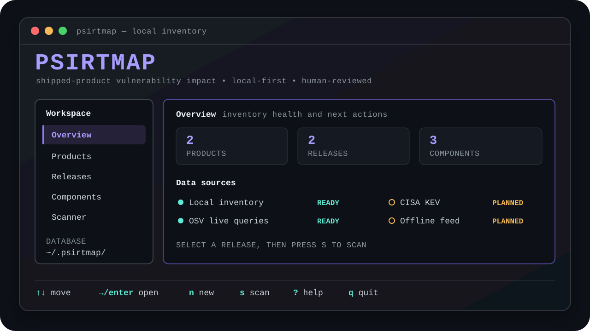

<table align="center">
  <tr>
    <td align="center" bgcolor="#0d1117">
      
    </td>
  </tr>
</table>

<div align="center">

# PSIRTMap

**Map newly disclosed vulnerabilities to the product versions you have actually shipped.**

Local-first product-security inventory and impact analysis for device,
firmware, and embedded-software manufacturers.

[](https://github.com/solongate/psirtmap/releases/latest)
[](https://github.com/solongate/psirtmap/actions/workflows/ci.yml)
[](go.mod)
[](LICENSE)

</div>



> [!IMPORTANT]
> PSIRTMap is pre-1.0. Inventory data is local, but vulnerability scans
> currently query the OSV API over the internet. Offline feeds, CycloneDX
> import, persistent findings, and human assessments are planned—not shipped.

## Why PSIRTMap?

A package scanner can tell you that `openssl@3.0.8` matches a vulnerability.
PSIRTMap is built to answer the product-security question that follows:

> Which versions of the products we shipped may contain that component?

| | Package scanner | PSIRTMap |
|---|---|---|
| Primary object | Image, filesystem, or package | Product release |
| Core question | Is this package version vulnerable? | Which shipped releases may be affected? |
| Result | Package-level match | Release-level finding that needs human review |

PSIRTMap deliberately reports matches as **potential impact**. A version match
is useful evidence; it is not proof that a shipped product is exploitable.

## What works today

The current release, `v0.0.3`, includes:

- A responsive, keyboard-driven terminal dashboard.
- Local SQLite inventory for products, releases, and components.
- Guided product, release, and component creation.
- Live release scanning through OSV package-version queries.
- Human-readable and deterministic JSON output.
- Single-binary builds for macOS, Linux, and Windows.
- No account, database server, or PSIRTMap cloud service.

See the [roadmap](ROADMAP.md) for the ordered path to SBOM import, finding
history, assessments, CISA KEV enrichment, offline feeds, and VEX.

## Install

Download the archive for your platform from the
[latest release](https://github.com/solongate/psirtmap/releases/latest) and
verify it with the published `checksums.txt` file.

Go users can install the latest tagged release directly:

```sh
go install github.com/solongate/psirtmap@latest
```

PSIRTMap requires no SQLite installation or background service.

## Start in 60 seconds

Open the dashboard:

```console
$ psirtmap
```

The first run creates `~/.psirtmap/psirtmap.db`. Use `n` to create a product,
then add a release and its components. Open **Scanner**, select a release, and
press `s`.

| Key | Action |
|---|---|
| `↑` / `↓` or `j` / `k` | Move through sections or rows |
| `←` / `→` or `h` / `l` | Move between navigation and content |
| `1`–`5` | Open a section directly |
| `n` | Create an item in the current section |
| `s` or `Enter` | Scan the selected release |
| `r` | Refresh local inventory |
| `?` | Show keyboard help |
| `q` | Quit |

Launch explicitly or use an isolated database:

```sh
psirtmap dashboard
psirtmap --database ./demo.db dashboard
```

<details>
<summary><strong>Prefer scriptable commands?</strong></summary>

The dashboard and CLI operate on the same local database.

```sh
psirtmap product add AG-200 --description "Industrial gateway"
psirtmap release add AG-200 2.2

psirtmap component add AG-200@2.2 openssl@3.0.8 --ecosystem Alpine
psirtmap component add AG-200@2.2 busybox@1.36.0 --ecosystem Alpine

psirtmap scan AG-200@2.2
```

Query one package without adding it to the inventory:

```sh
psirtmap check jinja2 2.4.1 --ecosystem PyPI
```

Use JSON output in scripts:

```sh
psirtmap product list --json
psirtmap scan AG-200@2.2 --json
```

Run `psirtmap help` or `psirtmap <command> --help` for complete usage.

</details>

## How it works

```text
Product -> Release -> Component -> Vulnerability match -> Human review
```

For example:

```text
AG-200
└── 2.2
    └── OpenSSL 3.0.8
        └── CVE / OSV match
            └── NEEDS REVIEW
```

During a scan, PSIRTMap sends the component's ecosystem, package name, and
version to OSV. The product name, release name, descriptions, and full local
inventory are not sent to a PSIRTMap service.

The explicit data model is:

```text
PRODUCT -> RELEASE -> COMPONENT -> VULNERABILITY -> FINDING -> ASSESSMENT
```

The final three objects are the next product milestone. Today, scan results
are displayed but are not yet persisted as assessment records.

## Local data

The default database is `~/.psirtmap/psirtmap.db`. PSIRTMap creates it with
permissions `0600` and applies compatible schema migrations automatically.

Choose another database with either:

```sh
psirtmap --database ./demo.db dashboard
PSIRTMAP_DB=./demo.db psirtmap product list
```

The explicit `--database` option takes precedence over `PSIRTMAP_DB`.

## Build from source

PSIRTMap requires Go 1.27 or newer.

```sh
go test ./...
go test -race -count=1 ./...
go vet ./...
go build -o psirtmap .
```

CI verifies formatting, dependencies, static analysis, race-enabled tests, and
release builds for macOS, Linux, and Windows.

## Project information

- [Roadmap](ROADMAP.md) — product direction and explicit non-goals
- [Security policy](SECURITY.md) — private vulnerability reporting
- [Contributing](CONTRIBUTING.md) — issue and pull-request policy
- [Changelog](CHANGELOG.md) — release history

## License

Copyright 2026 SolonGate. Licensed under the
[Apache License 2.0](LICENSE). See [NOTICE](NOTICE) and
[third-party notices](THIRD_PARTY_NOTICES.md).
