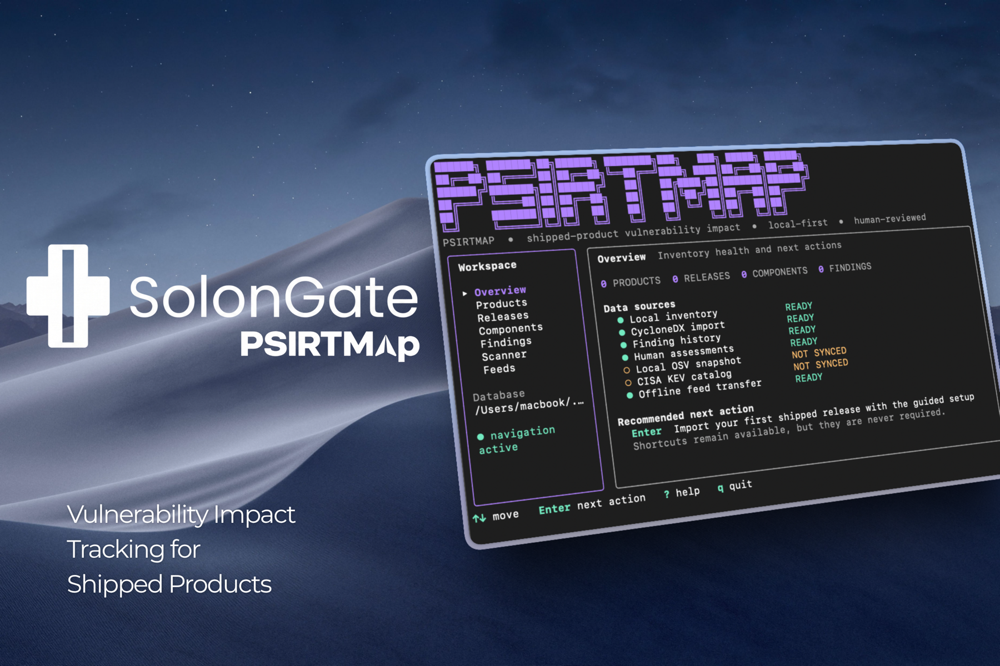

<table align="center">
  <tr>
    <td align="center" bgcolor="#0d1117">
      
    </td>
  </tr>
</table>

<div align="center">

# PSIRTMap

**Map newly disclosed vulnerabilities to the product versions you have actually shipped.**

Local-first product-security inventory and impact analysis for device,
firmware, and embedded-software manufacturers.

[](https://github.com/solongate/psirtmap/releases/latest)
[](https://github.com/solongate/psirtmap/actions/workflows/ci.yml)
[](go.mod)
[](LICENSE)

</div>



> [!IMPORTANT]
> PSIRTMap is pre-1.0. Normal release scans use local OSV and CISA KEV
> snapshots and do not require internet access after `psirtmap sync`.
> Versioned feed bundles can transfer those snapshots into machines that never
> connect to the internet.

## Why PSIRTMap?

A package scanner can tell you that `openssl@3.0.8` matches a vulnerability.
PSIRTMap is built to answer the product-security question that follows:

> Which versions of the products we shipped may contain that component?

| | Package scanner | PSIRTMap |
|---|---|---|
| Primary object | Image, filesystem, or package | Product release |
| Core question | Is this package version vulnerable? | Which shipped releases may be affected? |
| Result | Package-level match | Release-level finding that needs human review |

PSIRTMap deliberately reports matches as **potential impact**. A version match
is useful evidence; it is not proof that a shipped product is exploitable.

## What works today

The current release, `v0.0.9`, includes:

- A responsive, keyboard-driven terminal dashboard.
- A guided first-run flow that creates a product, release, and component
  inventory from one CycloneDX file.
- Local SQLite inventory for products, releases, and components.
- Atomic CycloneDX JSON import with package URL normalization and provenance.
- Guided product, release, and component creation.
- Atomic OSV synchronization for the package versions in the local inventory.
- Local CISA Known Exploited Vulnerabilities (KEV) synchronization and
  alias-aware finding enrichment.
- Local release scanning with source and snapshot freshness metadata.
- Durable findings with new, existing, reopened, and no-longer-matched states.
- A release-filterable `findings` command and dashboard view.
- Append-only human assessments with `investigating`, `affected`,
  `not-affected`, and `fixed` decisions.
- Reviewer, reason, evidence, timestamp, and complete decision history.
- Versioned, checksummed offline feed export and atomic import.
- Dashboard actions for online updates, offline feed import, and feed export.
- Persistent bundle provenance, source freshness, and import timestamps.
- An explicit `--live` scan mode for direct OSV checks.
- Human-readable and deterministic JSON output.
- Single-binary builds for macOS, Linux, and Windows.
- Checksum-verifying installers and a local readiness doctor.
- No account, database server, or PSIRTMap cloud service.

The unreleased main branch also adds normalized CVSS severity, fixed-version
boundaries, advisory references, KEV-first prioritization, severity/KEV
filters, and a detailed finding view. Missing or invalid CVSS data is shown as
`UNKNOWN`; PSIRTMap does not invent a score.

See the [roadmap](ROADMAP.md) for the ordered path to VEX and later PSIRT
workflow capabilities.

## Install

Install the latest release on macOS or Linux:

```sh
curl -fsSL https://raw.githubusercontent.com/solongate/psirtmap/main/scripts/install.sh | sh
```

The installer selects the current platform archive, verifies its published
SHA-256 checksum, and places `psirtmap` in a normal executable directory. You
can [review the installer](scripts/install.sh) before running it.

On Windows PowerShell:

```powershell
irm https://raw.githubusercontent.com/solongate/psirtmap/main/scripts/install.ps1 | iex
```

The Windows installer verifies the release checksum, installs the executable
under the current user's local programs directory, and adds that directory to
the user `PATH`.

<details>
<summary><strong>Other installation methods</strong></summary>

Download the archive for your platform from the
[latest release](https://github.com/solongate/psirtmap/releases/latest) and
verify it with the published `checksums.txt` file.

Go users can install the latest tagged release directly:

```sh
go install github.com/solongate/psirtmap@latest
```

Ensure Go's binary directory is on `PATH` after `go install`.

</details>

PSIRTMap requires no SQLite installation or background service.

## Start in 60 seconds

Open the dashboard:

```console
$ psirtmap
```

That is the complete launch command. The first run creates
`~/.psirtmap/psirtmap.db` and opens a guided setup. Press **Enter** and provide
the product name, release version, and CycloneDX JSON file. The dashboard then
guides you through updating vulnerability data, scanning the release, and
reviewing findings. Shortcuts are optional.

| Key | Action |
|---|---|
| `↑` / `↓` or `j` / `k` | Move through sections or rows |
| `←` / `→` or `h` / `l` | Move between navigation and content |
| `1`–`7` | Open a section directly |
| `Enter` | Run the highlighted or recommended action |
| `n` | Create an item in the current section |
| `i` | Import CycloneDX JSON from **Releases** |
| `Ctrl+O` | Browse for a file while a file field is active |
| `a` or `Enter` | Assess the selected finding from **Findings** |
| `u` | Update local OSV and CISA KEV data; this step uses the internet |
| `s` or `Enter` | Scan the selected release |
| `r` | Refresh local inventory |
| `?` | Show keyboard help |
| `q` | Quit |

Launch explicitly or use an isolated database:

```sh
psirtmap dashboard
psirtmap --database ./demo.db dashboard
```

<details>
<summary><strong>Prefer scriptable commands?</strong></summary>

The dashboard and CLI operate on the same local database.

```sh
psirtmap product add AG-200 --description "Industrial gateway"
psirtmap release import AG-200@2.2 ./firmware-2.2.cdx.json

psirtmap sync
psirtmap scan AG-200@2.2
psirtmap findings AG-200@2.2
psirtmap findings AG-200@2.2 --severity critical
psirtmap findings AG-200@2.2 --kev
psirtmap findings show AG-200@2.2 CVE-2026-12345
psirtmap assess AG-200@2.2 CVE-2026-12345 \
  --status not-affected \
  --reviewer emirhan \
  --reason "Vulnerable functionality is disabled in this firmware build"
psirtmap assess history AG-200@2.2 CVE-2026-12345
```

The import accepts CycloneDX JSON 1.2–1.7, walks nested components, derives
OSV identities from package URLs, records the document hash, and safely merges
repeated imports. Components without a supported package URL are reported as
skipped. Manual component entry remains available for demos and corrections.
An [example device SBOM](examples/ag-200/firmware-2.2.cdx.json) is included.

Query one package without adding it to the inventory:

```sh
psirtmap check jinja2 2.4.1 --ecosystem PyPI
```

Use a direct OSV query without changing the saved snapshot:

```sh
psirtmap scan AG-200@2.2 --live
```

Use JSON output in scripts:

```sh
psirtmap product list --json
psirtmap release import AG-200@2.2 ./firmware-2.2.cdx.json --json
psirtmap sync --json
psirtmap feed export ./psirtmap-feed.bundle --json
psirtmap feed import ./psirtmap-feed.bundle --json
psirtmap scan AG-200@2.2 --json
psirtmap findings --all --json
psirtmap findings show AG-200@2.2 CVE-2026-12345 --json
psirtmap assess history AG-200@2.2 CVE-2026-12345 --json
```

Run `psirtmap help` or `psirtmap <command> --help` for complete usage.
Run `psirtmap doctor` to see the database path, inventory counts, feed
freshness, and the next action required before scanning.

</details>

## How it works

```text
CycloneDX SBOM -> Product release -> Component inventory
                                         |
OSV API --------- psirtmap sync -------> local OSV snapshot
CISA KEV catalog -/             \------> local KEV snapshot
                                         |
                              offline release scan -> durable finding -> human assessment
```

For example:

```text
AG-200
└── 2.2
    └── OpenSSL 3.0.8
        └── CVE / OSV match
            └── NOT AFFECTED
                └── reviewer + reason + evidence + timestamp
```

During `sync`, PSIRTMap sends each distinct component ecosystem, package name,
and version to OSV. It stores the matching advisory metadata, aliases,
CVSS vectors, affected ranges, fixed boundaries, references, retrieval time,
and exact package-version match in SQLite. Supported CVSS 2.0, 3.0, 3.1, and
4.0 vectors are normalized into a severity label without changing the source
vector. It also downloads [CISA's complete public KEV catalog](https://www.cisa.gov/known-exploited-vulnerabilities-catalog)
and stores the catalog version, freshness, CVE metadata, required action, due
date, and ransomware-use signal. Product names, release names, descriptions,
and complete SBOM files are not sent to either source.

Normal `scan` commands read those saved snapshots and make no remote request.
A finding is marked as known exploited when its OSV identifier or one of its
aliases matches a KEV CVE. KEV is a prioritization signal; it does not prove
that a particular product configuration is exploitable. A new or changed
component needs another successful `sync`; a failed source update preserves
the last known-good local data. `check`, `sync`, `feed pull`, and `scan --live`
are the operations that require internet access.

Finding lists put KEV matches first, followed by normalized severity and
source recency. An OSV fixed boundary means that a source range ends at that
version; it is not an automatic recommendation or proof that upgrading alone
remediates a particular product.

## Air-gapped transfer

On a connected staging machine, create the same component inventory used in
the isolated environment, then download and export its intelligence:

```sh
psirtmap --database ./staging.db feed pull
psirtmap --database ./staging.db feed export ./psirtmap-feed.bundle
```

Move the `.bundle` through the organization's approved transfer process. On
the isolated machine:

```sh
psirtmap feed import ./psirtmap-feed.bundle
psirtmap scan AG-200@2.2
```

The bundle contains the inventory-scoped OSV matches and the complete CISA KEV
catalog. It does **not** contain product names, releases, SBOM documents,
findings, assessments, or customer data. The connected staging inventory must
therefore cover every package version that the isolated installation needs to
scan.

Each bundle is a versioned ZIP with a manifest and SHA-256 checksum for every
data file. Import rejects missing, extra, oversized, malformed, or modified
content before replacing either local snapshot; OSV and KEV activation and
provenance recording happen in one database transaction. Checksums detect
accidental corruption, but they do not prove who created a bundle. Accept feed
files only through a trusted transfer path. Bundle signing is not yet shipped.

Every successful normal scan reconciles its matches with the release's saved
finding history. A first match is `new`, a repeated match is `existing`, a
returning match is `reopened`, and a finding missing from the latest complete
scan becomes `no-longer-matched` without losing its history. `scan --live` is
diagnostic and never changes durable findings.

An assessment changes the finding's current review state while appending a
history entry. Final decisions—`affected`, `not-affected`, and
`fixed`—require a reason. `investigating` may be recorded while evidence is
still being collected. Re-scanning refreshes match evidence without erasing or
resetting the human decision.

The explicit data model is:

```text
PRODUCT -> RELEASE -> COMPONENT -> VULNERABILITY -> FINDING -> ASSESSMENT
```

Vulnerability records, KEV metadata, findings, and assessment history all
live locally.

## Local data

The default database is `~/.psirtmap/psirtmap.db`. PSIRTMap creates it with
permissions `0600` and applies compatible schema migrations automatically. It
contains shipped-product inventory, the active OSV and CISA KEV snapshots,
feed-import provenance, scan audit records, durable finding history, and
append-only human assessments.

Before an existing database is migrated, PSIRTMap creates a consistent,
permission-restricted backup beside it. If that backup cannot be completed,
the migration does not start.

Choose another database with either:

```sh
psirtmap --database ./demo.db dashboard
PSIRTMAP_DB=./demo.db psirtmap product list
```

The explicit `--database` option takes precedence over `PSIRTMAP_DB`.

## Build from source

PSIRTMap requires Go 1.27 or newer.

```sh
go test ./...
go test -race -count=1 ./...
go vet ./...
go build -o psirtmap .
```

CI verifies formatting, dependencies, known reachable Go vulnerabilities,
static analysis, race-enabled tests, and release builds for macOS, Linux, and
Windows.

## Project information

- [Roadmap](ROADMAP.md) — product direction and explicit non-goals
- [Architecture](docs/ARCHITECTURE.md) — components, data flow, and persistence invariants
- [Threat model](docs/THREAT_MODEL.md) — trust boundaries, controls, and known limitations
- [Security policy](SECURITY.md) — private vulnerability reporting
- [Contributing](CONTRIBUTING.md) — issue and pull-request policy
- [Changelog](CHANGELOG.md) — release history

## License

Copyright 2026 SolonGate. Licensed under the
[Apache License 2.0](LICENSE). See [NOTICE](NOTICE) and
[third-party notices](THIRD_PARTY_NOTICES.md).
